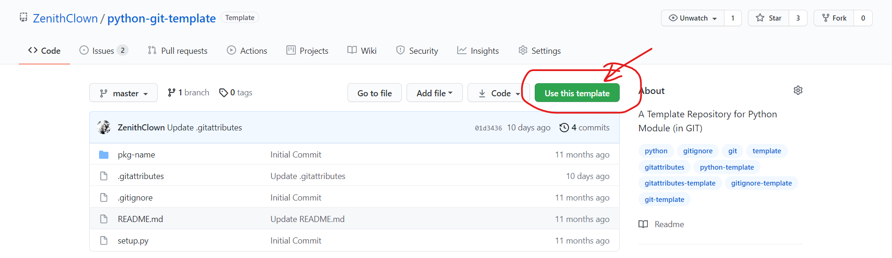
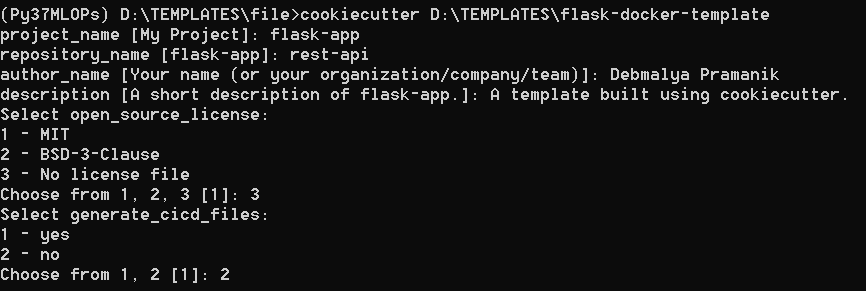

<h1 align = "center">
	Flask Template <br>
	<sub><b><i>(python, docker, rest-api, flake8)</i></b></sub> <br>
	<a href = "https://www.linkedin.com/in/dpramanik/"></a>
	<a href = "https://github.com/ZenithClown"></a>
	<a href = "https://gitlab.com/ZenithClown/"></a>
	<a href = "https://www.researchgate.net/profile/Debmalya_Pramanik2"></a>
	<a href = "https://www.kaggle.com/dPramanik/"></a>
	<a href = "https://app.pluralsight.com/profile/Debmalya-Pramanik/"></a>
	<a href = "https://stackoverflow.com/users/6623589/"></a>
	<br>
	<a href="https://github.com/ZenithClown/flask-docker-template/issues"></a>
	<a href="https://github.com/ZenithClown/flask-docker-template/network"></a>
	<a href="https://github.com/ZenithClown/flask-docker-template/stargazers"></a>
	<a href="https://github.com/ZenithClown/flask-docker-template/blob/master/LICENSE"></a>
	<a href="https://app.travis-ci.com/ZenithClown/flask-docker-template.svg?branch=master"></a><sup><b>*</b></sup>
</h1>

<p align = "justify">A simple <i>flask-template</i> for REST-API design and implementation. Please include the <a href = "https://github.com/ZenithClown/flask-docker-template/tree/master">Template Link</a> in your design. Template includes <code>.gitignore</code> and <code>.gitattributes</code> related to python and flask-api model. You can also update/change/delete <code>LICENSE</code> as required. Other files are related to <code>docker</code> and <code>flake8</code> (code linting) is included with basic setup. The template is built on GitHub, thus <code>.github</code> directory is included with issue template, and workflows directory.</p>

**NOTE:** some optional usage, specifications, and helpful links are as below:
  1. You can add GitHub Repository Badges from [Shields IO](https://shields.io/) - if this is a Public Repository;
  2. TAB (size = 4) has been used for indentation.
  3. `.github/workflows` is added however, it is recomended that you create your own workflows either using **GitHub Actions** or on your own.
  4. Basic `docker` files are added for convention, modify it as per requirement. Recomended to delete the file, if not required.
  5. The repository uses `markdown` instead of `rich text format`, so make necessary changes to file extension/type as required.
  6. [Engine Configuration](https://docs.sqlalchemy.org/en/14/core/engines.html) for SQLAlchemy Documentation.

## Quick Start Guide
<p align = "justify">Introduced in 2019, users can now create a repository from templates in GitHub. To do this, simply head over to any repository settings and enable "Template Repository" from the Options Menu. When creating a <i>new repository</i> from this template, you can just click on <b><code>Use this template</code></b> available in this repository (refer the picture below).</p>



### Creating a NEW Repository from Template
<p align = "justify">Template Repository is not limited to GitHub, and you can setup your own local-file structure for the same. The following describes the usage of <code>rsync</code> which is available in most linux distros, <a href = "https://linux.die.net/man/1/rsync">more information on rsync</a>.</p>

```bash
# Note the use of rsync
rsync -rh ~/source/directory /destination/directory
```

### Generate Template using `cookiecutter`
<p align = "justify"><a href = "https://cookiecutter.readthedocs.io/en/1.7.3/README.html">cookiecutter</a> is an excellet module for creating projects from templates. The process can be done so locally (as shown below), or using command line utility <code>cookiecutter https://github.com/ZenithClown/flask-docker-template/tree/cookiecutter</code> by directly accesing the repository from GitHub.</p>



## Setup Information
<p align = "justify">Configure the application by setting <code>ENVIRONMENT VARIABLES</code> as required. Sample variables are provided in <code>.env.bkp</code>, however for production grade application is is recomended that you set them at <code>$PATH</code>. Start the application using <code>python manage.py</code> which serves the port <code>0.0.0.0:5000</code> by default.</p>

---

<p align = "justify"><b>*</b> Travis CI allows only 10k Credits on free-tier. The build might be old, please re-enable and check service if required.</p>
